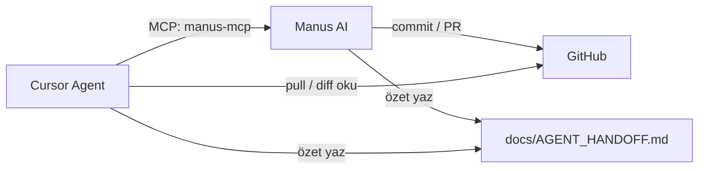

# Manus AI ↔ Cursor entegrasyon rehberi

## Kısa cevap

**Tam otomatik “birbirinin kafasına girme” yok** — iki ayrı ürün. Ama **%90 senkron** şu üçlüyle mümkün:



---

## 1. GitHub (zaten bağlı — en güçlü köprü)

| Yön | Nasıl |
|-----|-------|
| Manus → Cursor | Manus commit/PR atar → Cursor `git pull` + diff okur |
| Cursor → Manus | Cursor commit push eder → Manus repo’yu görür |

**Öneri:** Manus’a şunu söyle:
> “Her iş bitince `docs/AGENT_HANDOFF.md` güncelle ve ayrı commit at. Mobil için `Niyetsen-mobile`, backend için `Niyetsen` repo.”

---

## 2. Ortak handoff dosyası (kararlar + bağlam)

Dosya: **`docs/AGENT_HANDOFF.md`**

- Manus Instagram metni, store copy, araştırma özeti → buraya yazar
- Cursor kod değişikliği, branch, test sonucu → buraya yazar
- Her iki ajan da oturum başında bu dosyayı okumalı

Cursor’da bana şunu yazman yeterli:
> “AGENT_HANDOFF’u oku, Manus’un son kayıtlarına göre devam et.”

---

## 3. Manus MCP (Cursor içinden Manus’a erişim)

Manus API key: [open.manus.ai](https://open.manus.ai) dashboard.

### Cursor kurulumu

1. **Cursor → Settings → Tools & MCP → Add MCP Server**
2. Veya proje kökünde `.cursor/mcp.json` (`.gitignore`’a ekle — key commit etme):

```json
{
  "mcpServers": {
    "manus-mcp": {
      "command": "npx",
      "args": ["-y", "manus-mcp"],
      "env": {
        "MANUS_MCP_API_KEY": "BURAYA_MANUS_API_KEY"
      }
    },
    "supabase": {
      "type": "http",
      "url": "https://mcp.supabase.com/mcp?project_ref=ktweahgrrppmxpdhohdh"
    }
  }
}
```

3. MCP panelinde **Connect / Authenticate** (Manus + Supabase OAuth)
4. Yeşil toggle görününce Cursor, Manus’a task oluşturabilir / webhook alabilir

Şablon dosya: `.cursor/mcp.json.example` (repoda, key’siz)

---

## 4. Supabase bağlantısı

İkiniz de aynı projeyi görürsünüz — ama bu **ürün verisi** (users, tasks), ajan bağlamı değil.

| Kim | Anahtar |
|-----|---------|
| Manus / Cursor backend işleri | `service_role` — sadece backend/Railway |
| Mobil | `publishable` only |
| MCP Supabase | OAuth ile dashboard erişimi |

**Sırları repoya yazma.**

---

## 5. İş bölümü (önerilen)

| Manus AI | Cursor |
|----------|--------|
| Instagram Reels, store metinleri | Kod, API, mobil UX |
| Araştırma, doküman taslağı | Test, deploy, Supabase migration |
| Hukuk metni taslağı (hukukçu onayı sonra) | `legal.ts` + backend consent entegrasyonu |
| GitHub’a içerik commit | `fix/ux-consent-optimizasyon` merge / PR |

---

## 6. Senin yapman gerekenler (tek seferlik)

1. [ ] Manus API key al → Cursor MCP’ye ekle
2. [ ] Manus’a de ki: “Her oturum sonu `docs/AGENT_HANDOFF.md` güncelle”
3. [ ] GitHub: Manus hangi repo/branch’e push ediyor netleştir (mobile ayrı repo!)
4. [ ] Bana: “handoff oku” veya Manus özetini yapıştır

---

## 6. Railway MCP (Cursor kırmızıysa)

Detay: `niyetsen-backend/RAILWAY_DEPLOY.md` § Cursor Railway MCP

- **Remote (kolay):** `railway-remote` → `https://mcp.railway.com` → OAuth Connect
- **Local:** `npm i -g @railway/cli` + `railway login` + `~/.cursor/mcp.json` içinde **node tam yolu**
  (`spawn railway ENOENT` → PATH sorunu; `railway.js` + `/usr/local/bin/node` kullan)
- **Reload Window** zorunlu

---

## Sık sorulan

**Manus benim Cursor sohbetimi görür mü?**  
Hayır. Sadece handoff + GitHub + senin yapıştırdığın özet.

**Ben Manus’un tüm geçmişini görür müyüm?**  
Hayır. MCP task/webhook veya handoff ile sınırlı.

**%100 senkron mümkün mü?**  
Pratikte GitHub + AGENT_HANDOFF + MCP ile yeterli; tam eşzamanlı “tek beyin” değil, **ortak dashboard** modeli.
